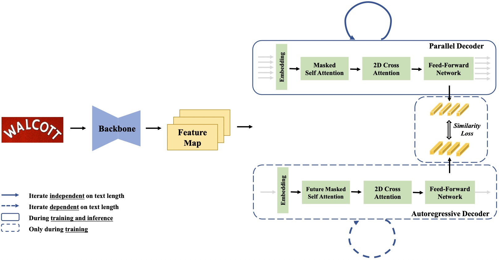

# PIMNet: A Parallel, Iterative and Mimicking Network for Scene Text Recognition

## Introduction
The implementation of the paper "PIMNet: A Parallel, Iterative and Mimicking Network for Scene Text Recognition", ACM MM 2021 ([paper](https://arxiv.org/abs/2109.04145)).

PIMNet is a parallel and iterative based text recognition methods, where the easy-first decoding strategy is adopted. Additionally, the mimicking learning is used to help the learning of the parallel decoder.



## How to use
### Runtime Environment
```
Python3.5
TensorFlow 1.12.0
```
Details can be found in requirements.txt

### Train
- Please prepare the LMDB of Synth90K and SynthText (or download from the links shared by others), and offline-augmentented images provided by [SRN](https://github.com/PaddlePaddle/PaddleOCR/blob/release/2.1/doc/doc_ch/recognition.md).
##### Run
```
python3 train.py --checkpoints /path/to/save/checkpoints --train_data_dir /path/to/train/data/lmdb/1 /path/to/train/data/lmdb/2 /path/to/train/data/lmdb/3... --test_data_dir /path/to/validation/dataset -g "0" -b 256 -v 256
```
For more details about the hyper-parameters, please refer to config.py.
### Evaluation
- Please prepare the LMDB of the benchmarks (or download from the links shared by others).
```
python3 test.py --checkpoints /path/to/the/checkpoints --test_data_dir /path/to/evaluation -g "0"
```

### Pretrained Model
The model trained only on synthetic datasets with mimicking learning can be found at [BaiduNetDisk](https://pan.baidu.com/s/1vvWRKLR63167eMdHnlWrIQ) (key: a787) or [GoogleDrive](https://drive.google.com/file/d/1qVqhyfTxu1DFRSXJQVfDukbOnRLyKVKS/view?usp=sharing). 

### Citation
If you find our method useful for your reserach, please cite
```
@inbook{10.1145/3474085.3475238,
author = {Qiao, Zhi and Zhou, Yu and Wei, Jin and Wang, Wei and Zhang, Yuan and Jiang, Ning and Wang, Hongbin and Wang, Weiping},
title = {PIMNet: A Parallel, Iterative and Mimicking Network for Scene Text Recognition},
year = {2021},
isbn = {9781450386517},
publisher = {Association for Computing Machinery},
address = {New York, NY, USA},
url = {https://doi.org/10.1145/3474085.3475238},
booktitle = {Proceedings of the 29th ACM International Conference on Multimedia},
pages = {2046–2055},
numpages = {10}
}
```
